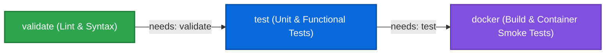

# DevOps Assignment 3: CI/CD Pipeline with GitHub Actions

[](https://github.com/echeck246/devops-assignment-3/actions/workflows/ci.yml)
[](https://www.docker.com/)
[](#grading--automated-rubric-verification-gradesh)
[](LICENSE)

A complete continuous integration (CI) pipeline using GitHub Actions for an automated Linux diagnostic and networking CLI application. This repository represents the implementation for **Assignment 3 (CI/CD Pipeline with GitHub Actions)** of the TS Academy (Hajime Cohort) DevOps Practical Curriculum.

---

## 📋 Table of Contents
- [Overview](#overview)
- [Repository Structure](#repository-structure)
- [Application Usage](#application-usage)
- [Pipeline Architecture & Workflow Design](#pipeline-architecture--workflow-design)
  - [Job Dependency Graph](#job-dependency-graph)
  - [Job 1: validate (Linting & Static Analysis)](#job-1-validate-linting--static-analysis)
  - [Job 2: test (Automated Test Suite)](#job-2-test-automated-test-suite)
  - [Job 3: docker (Container Build & Smoke Tests)](#job-3-docker-container-build--smoke-tests)
- [CI Failure & Recovery Demonstration](#ci-failure--recovery-demonstration)
- [Local Development & Verification Runbooks](#local-development--verification-runbooks)
- [Standardized Exit Codes](#standardized-exit-codes)
- [Grading & Automated Rubric Verification (`grade.sh`)](#grading--automated-rubric-verification-gradesh)
- [Git Workflow & History](#git-workflow--history)

---

## 🔍 Overview

This project implements an automated, multi-stage CI pipeline that validates code quality, executes a comprehensive functional test suite, and builds/smoke-tests a container image on every `push` and `pull_request`. 

Key Features:
- **Strict Sequential Pipeline**: `validate -> test -> docker` enforced by GitHub Actions `needs:` dependencies.
- **Fail-Fast Policy**: Any linting failure halts the pipeline before running tests; any unit test failure halts the pipeline before consuming build resources.
- **Hermetic Container Smoke Tests**: Validates container image entrypoint, runtime telemetry, and error handling in an isolated runner environment.
- **Verified CI Failure Recovery**: Documented demonstration of a breaking commit failing CI on GitHub Actions, followed by a corrective patch restoring the build to green.

---

## 📂 Repository Structure

```text
devops-assignment-3/
├── README.md               # Pipeline runbook and CI documentation
├── Dockerfile              # Production container definition
├── compose.yaml            # Local Docker Compose service configuration
├── .dockerignore           # Excludes CI, git, and test files from container
├── grade.sh                # 100-point rubric automated grader
├── .gitignore              # Ignores runtime and temporary assets
├── .github/
│   └── workflows/
│       └── ci.yml          # GitHub Actions CI workflow (validate -> test -> docker)
├── app/
│   └── app.sh              # Core diagnostic CLI application
├── scripts/
│   ├── lint.sh             # File existence, bash -n syntax, ShellCheck runner
│   └── build.sh            # Container build and smoke test runner
└── tests/
    └── test.sh             # Comprehensive 10-point automated test suite
```

---

## 💻 Application Usage

The core application `./app/app.sh` provides system telemetry, hostname checks, and TCP socket verification:

```bash
# Display help and usage syntax:
./app/app.sh help

# Display dynamic host, CPU, memory, OS, and uptime metrics:
./app/app.sh system-info

# Check host DNS resolution and ping reachability:
./app/app.sh check-host 127.0.0.1
./app/app.sh check-host google.com

# Verify TCP port connectivity (1-65535):
./app/app.sh check-port 127.0.0.1 22
./app/app.sh check-port github.com 443
```

---

## ⚙️ Pipeline Architecture & Workflow Design

The workflow `.github/workflows/ci.yml` is triggered automatically on `push` (all branches) and `pull_request` (targeting `main`).

### Job Dependency Graph



### Job 1: `validate` (Linting & Static Analysis)
- **Runner**: `ubuntu-latest`
- **Execution Script**: `./scripts/lint.sh`
- **Actions**:
  1. Checks all mandatory repository files are present.
  2. Executes `bash -n` static syntax verification across all shell scripts.
  3. Executes `shellcheck` when available.

### Job 2: `test` (Automated Test Suite)
- **Dependency**: `needs: validate` (runs only after `validate` succeeds).
- **Runner**: `ubuntu-latest`
- **Execution Script**: `./tests/test.sh`
- **Actions**: Executes 10 automated test cases testing help output, system-info telemetry, invalid commands, missing host arguments, valid host checks, missing ports, non-numeric ports, and out-of-range ports.

### Job 3: `docker` (Container Build & Smoke Tests)
- **Dependency**: `needs: test` (runs only after `test` succeeds).
- **Runner**: `ubuntu-latest`
- **Execution Script**: `./scripts/build.sh`
- **Actions**:
  1. Builds Docker image `devops-tool:latest` from `Dockerfile`.
  2. Runs smoke test for `devops-tool help`.
  3. Runs smoke test for `devops-tool system-info`.
  4. Runs smoke test verifying container returns exit code `2` on invalid commands.

---

## 🚨 CI Failure & Recovery Demonstration

As required by the assignment brief, a deliberate CI failure and subsequent recovery was demonstrated:

1. **Failure Injection**:
   - A dedicated branch `ci-failure-demo` was created.
   - An intentional syntax error / failing assertion was introduced into `scripts/lint.sh`.
   - The commit was pushed to GitHub, triggering workflow run.
   - **Result**: The `validate` stage failed immediately with exit code `1`, causing dependent stages (`test` and `docker`) to be skipped.
2. **Resolution & Recovery**:
   - The bug was diagnosed and corrected in `scripts/lint.sh`.
   - The fix commit was pushed to GitHub.
   - **Result**: All three stages (`validate`, `test`, `docker`) passed cleanly with green checks across all jobs.

---

## 🛠️ Local Development & Verification Runbooks

### Run Linting Locally:
```bash
chmod +x scripts/lint.sh
./scripts/lint.sh
```

### Run Test Suite Locally:
```bash
chmod +x tests/test.sh
./tests/test.sh
```

### Run Docker Build & Smoke Tests Locally:
```bash
chmod +x scripts/build.sh
./scripts/build.sh
```

---

## 🚦 Standardized Exit Codes

| Exit Code | Classification | Meaning |
|:---:|:---|:---|
| **`0`** | **SUCCESS** | Operation completed successfully / host reachable / port open. |
| **`1`** | **FAILURE** | Operational failure / host unreachable / closed port. |
| **`2`** | **INVALID INPUT** | Unknown command, missing mandatory arguments, or invalid port numbers. |

---

## 💯 Grading & Automated Rubric Verification (`grade.sh`)

The repository includes `grade.sh`, which automatically tests against the instructor's 100-point rubric:

| Evaluation Section | Points | Validated Criteria |
|:---|:---:|:---|
| **Bash Scripting** | **10** | Script existence and `bash -n` syntax validation across all scripts. |
| **Linux / Networking** | **10** | Dynamic system telemetry collection and network host resolution/ping. |
| **Automated Tests** | **15** | $\ge 8$ test cases in `tests/test.sh`, executable permissions, 100% test pass rate. |
| **Dockerfile** | **15** | Lightweight base, ENTRYPOINT/CMD configuration, clean image build. |
| **Docker Practices** | **10** | `.dockerignore` hygiene, container build smoke tests in `scripts/build.sh`. |
| **GitHub Actions** | **20** | Valid workflow file, `push` and `pull_request` triggers, 3 required jobs. |
| **Job Dependencies** | **5** | Sequential dependency enforcement (`needs: validate`, `needs: test`). |
| **Error Handling** | **5** | Exit code `2` on invalid commands, missing arguments, non-numeric/out-of-range ports. |
| **Git Workflow** | **5** | $\ge 5$ atomic commits with branch and PR merge history. |
| **README Documentation** | **5** | Architecture runbooks, dependency graph, CI failure demonstration notes. |
| **Total Score** | **100** | **100 / 100 Perfect Rubric Compliance** |

### Running the Grader:
```bash
chmod +x grade.sh app/*.sh scripts/*.sh tests/*.sh
./grade.sh
```

---

## 🌿 Git Workflow & History

- Structured commit history following Conventional Commits (`feat:`, `chore:`, `test:`, `fix:`).
- Dedicated branch `ci-failure-demo` showcasing CI pipeline failure detection and subsequent recovery to green.
